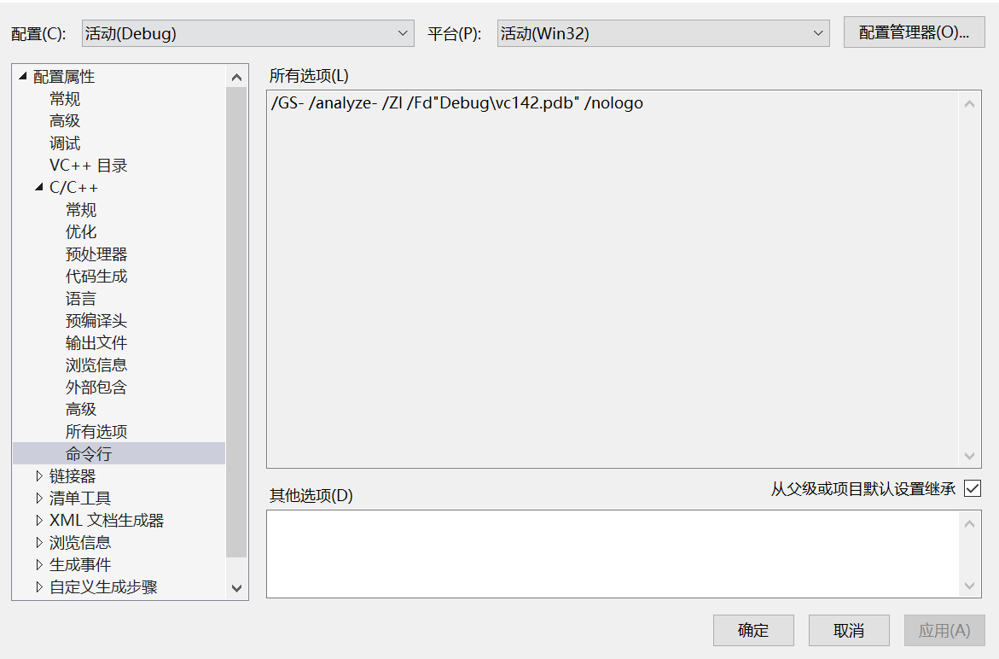
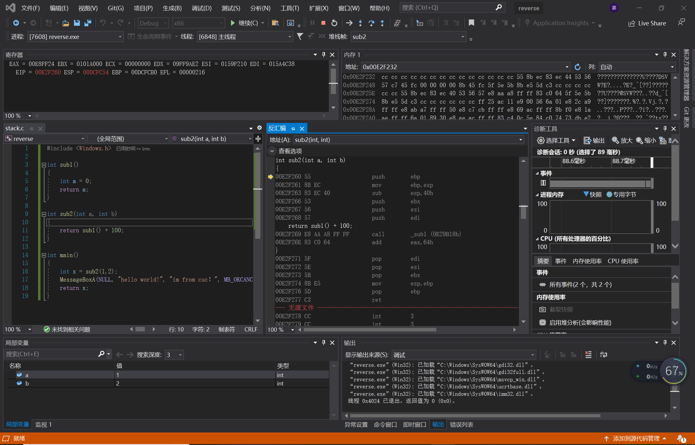
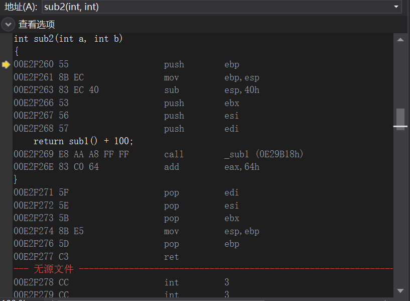

# 逆向工程作业一

## 实验过程
1. 在vs中建立工程，修改编译选项，只保留 /ZI （调试）和pdb文件路径两个选项，增加禁用安全检查选项（/GS-)。

   
2. 编译多个函数调用的示例代码。
```
#include <Windows.h>

int sub1()
{
	int a = 0;
	return a;
}

int sub2(int a, int b)
{
	return sub1() + 100;
}

int main()
{
	int x = sub2(1,2);
	MessageBoxA(NULL, "hello world!", "im from cuc！", MB_OKCANCEL);
	return x;
}
```

3. 下断点调试运行，观察反汇编、寄存器、内存等几个调试时的信息。
* 将断点设置在main函数的下一行，在Debug X86的条件下启动调试，打开调试-窗口中的反汇编、内存和寄存器进行观察



4. 分析函数调用过程中栈的变化。解释什么是栈帧？ebp寄存器在函数调用过程中的变化过程，ebp寄存器的作用。
   
栈帧：每一次函数的调用，都会在调用栈上维护一个独立的栈帧，一个函数的栈帧用ebp和esp来划定范围
ebp：基址指针寄存器，存放着一个指针，该指针指向系统栈最上面一个栈帧的底部
ebp作用：主要是用来保存和恢复堆栈，寻址并将将参数传递给函数


(1)ebp入栈，保存当前栈帧状态值，以备调用完成后恢复栈帧使用(保存之前的任务信息)
(2)将esp的值赋给ebp，将之前的栈顶作为新的基址(栈底)
(3)分配一定的空间用作被调用函数的堆栈
(4)ebx,esi,edi指令用于记录一些参数信息
(5)call调用函数sub2
(6)将两个值进行相加(sub1()+100)
(7)将参数都弹出栈
(8)恢复esp同时回收局部变量的空间
(9)将当前栈帧底部保存的ebp值输入到ebp寄存器中，恢复上一个栈帧
(10)当前栈顶元素出战并从栈中返回地址，跳转到该位置，堆栈恢复到函数调用前的状态


5. 函数局部变量和参数的保存位置、访问方式是什么。

* 函数的局部变量和参数保存在栈中，因为其作用域仅在函数内部，在调用函数时，会在栈上申请一定空间存放局部变量和参数，通过ebp指针进行寻址访问

6. 多层的函数调用，栈的变化情况，解释未赋初始值的局部变量的值是如何形成的。

* 局部变量是分配在栈上的，在未赋初始值的情况下，是随机数，取决于变量在栈中的位置和变量对于的栈位置在之前有没有存储过其他值，因为栈的内存是反复使用的


## 课堂总结

在逆向工程时（从二进制程序分析程序的实现原理时）：
1. 首先是进行反汇编 dumpbin /disasm 还有很多工具如IDA PRO
2. 在反汇编中，call指令代表了所有函数调用。那么call的参数就一定是一个函数。
因此可以分析出，被逆向的程序中有多少函数，以及每个函数的范围。
3. 在函数内部，所有的ebp+x就是参数，能够通过分析反汇编代码中的ebp+x，得到函数的参数。所有的ebp-x就是函数的局部变量。
由于函数的局部变量、参数和调用返回地址都保持在栈中，如果给局部赋值超过了存储空间的范围，可能会在函数返回时程序的执行异常（eip被覆盖和控制），这个就是最典型的缓冲区溢出漏洞。
